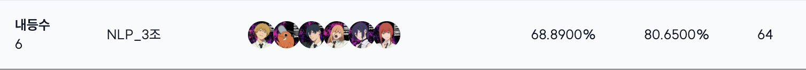
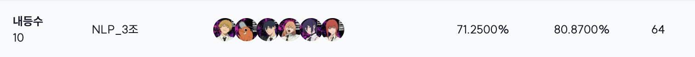
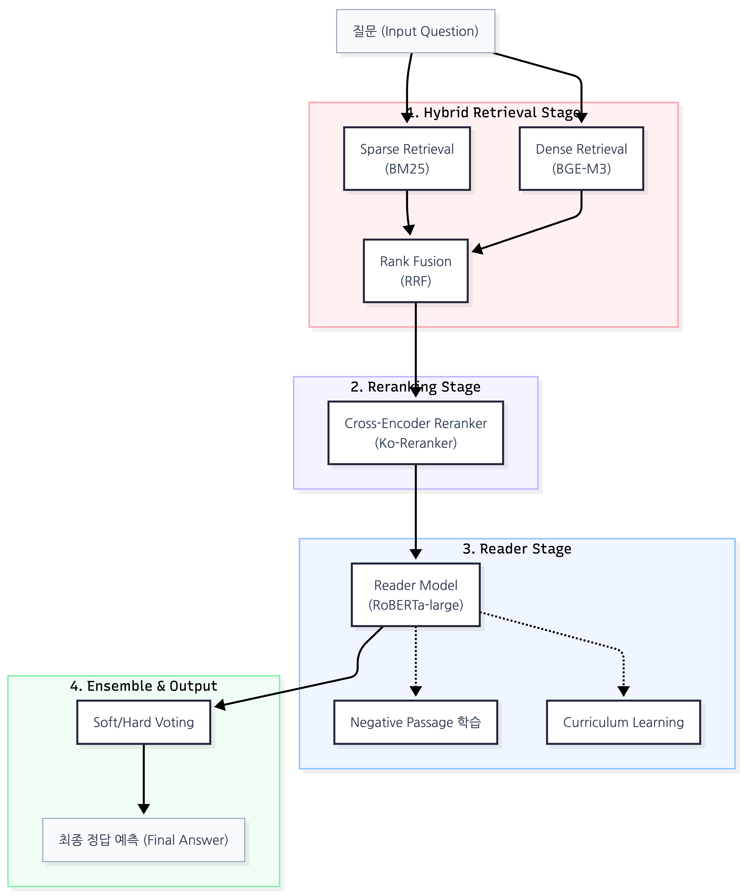

<div align='center'>

# 🏆 NLP Project : Open-Domain Question Answering
</div>

## ✏️ 대회 소개

|   특징     | 설명                                                                                                                          |
| :---------: | ---------------------------------------------------------------------------------------------------------------------------- |
|  대회 주제  | 네이버 부스트캠프 AI-Tech 8기 NLP 트랙의 Open-Domain Question Answering (ODQA) 대회                                           |
|  대회 설명  | 질문에 대해 방대한 지문(Corpus)에서 관련 문서를 찾아내고(Retriever), 정답을 추론(Reader)하는 시스템 구축 |
|  진행 기간  | 2025년 12월 3일 ~ 2025년 12월 11일                                                         |
| 데이터 구성 | Wikipedia Passage (60,613개), KorQuAD v1/v2 학습 데이터          |
|  평가 지표  | Exact Match (EM) - 정답 완전 일치 여부 (메인 지표), F1 Score                                                                                                   |
|  랩업 리포트 | [Gen for NLP NLP-03 랩업 리포트](https://github.com/boostcampaitech8/pro-nlp-mrc-nlp-03/blob/main/assets/MRC_NLP-03.pdf) |

## 🎖️ Leader Board
### Priavate Leader Board (6위)


### Public Leader Board (10위)


## 👨‍💻 Contributors

<table align='center'>
  <tr>
    <td align="center">
      <br>
      <a href="https://github.com/choijunho-AIDeveloper">
        
      </a>
    </td>
    <td align="center">
      <br>
      <a href="https://github.com/kyunhui">
        
      </a>
    </td>
    <td align="center">
      <br>
      <a href="https://github.com/Parkseojin2001">
        
      </a>
    </td>
    <td align="center">
      <br>
      <a href="https://github.com/shihtzu-918">
        
      </a>
    </td>
    <td align="center">
      <br>
      <a href="https://github.com/2sseul">
        
      </a>
    </td>
    <td align="center">
      <br>
      <a href="https://github.com/hyejinw">
        
      </a>
    </td>
  </tr>
</table>

## 👼 역할 분담

| 이름   | 역할                                                                                                          |
| ------ | ------------------------------------------------------------------------------------------------------------ |
| 김&#8288;윤&#8288;희 | 데이터 EDA, Hybrid Retrieval(BM25+Dense) 설계 및 구현, Reader Fine-tuning, 앙상블 전략 수립 |
| 박&#8288;서&#8288;진 | Dense Retrieval 실험 및 모델(BGE-M3 등) 선정, Retrieval 파인튜닝 실험, 데이터 전처리 |
| 곽&#8288;나&#8288;영 | 데이터 전처리 파이프라인 구축, Hybrid Retrieval 구현 및 성능 최적화, Retrieval Fine-tuning |
| 김&#8288;이&#8288;슬 | KorQuAD 2.0 데이터 전처리 및 증강, ElasticSearch 기반 Retrieval 구현 및 실험 |
| 우&#8288;혜&#8288;진 | BM25 기반 Sparse Retrieval 구현, Reader 모델 개선(Negative Passage, Curriculum Learning), Qwen3 실험 |
| 최&#8288;&#8288;준호 | Curriculum Learning 난이도 지표(Embedding+Position) 구성 및 모델 학습, 앙상블(Soft/Hard Voting) 구현 |

## ✍🏻 프로젝트 개요

본 프로젝트는 수만 개의 위키피디아 지문 중 질문에 적합한 정보를 찾아 정확한 답을 내놓는 **ODQA 시스템**의 성능을 극대화하는 것을 목표로 합니다. 단순 검색을 넘어 의미론적 유사도와 학습 난이도를 조절하는 고도화된 전략을 사용했습니다.

### 주요 특징

- **Hybrid Retrieval & Reranking**: 
  - **BM25**(Sparse)와 **BGE-M3**(Dense)를 결합하여 키워드와 의미를 동시에 포착
  - **RRF(Reciprocal Rank Fusion)**를 통한 안정적인 순위 통합 및 **Cross-Encoder Reranker**로 상위 문서 재정렬
- **Reader Optimization**: 
  - **Negative Passage Training**: 정답이 없는 오답 지문을 학습에 포함하여 모델의 변별력 강화
  - **Curriculum Learning**: Passage 개수와 정답 위치 정보를 활용해 Easy → Medium → Hard 순으로 단계적 학습 수행
- **Robustness**: 
  - Stride(128)를 적용한 Passage Chunking으로 문맥 손실 최소화
  - Position Bias 완화를 위해 정답 위치 랜덤화 적용
- **Ensemble Strategy**: 문자열 유사도 기반의 **Soft Voting**을 통해 개별 모델의 오답을 상호 보완

### 📃 시스템 아키텍처




## 📁 폴더 구조
```
korean-mrc-negative-passage/
├── data_preparation/          # 데이터셋 생성
│   ├── create_negative_passage_dataset.py
│   └── build_passages.py
├── retrieval/                 # 검색 모듈
│   ├── retrieval.py
│   ├── retrieval_bm25.py
│   ├── retrieval_dense.py
│   ├── retrieval_hybrid.py
│   ├── retrieval_hybrid_passage.py
│   └── retrieval_hybrid_passage_rerank_only.py
├── training/                  # 학습 모듈
│   ├── train.py
│   ├── trainer_qa.py
│   ├── arguments.py
│   └── utils_qa.py
├── inference/                 # 추론 모듈
│   ├── inference.py
│   ├── inference_bm25.py
│   └── inference_hybrid_passage_rerank_only.py
├── ensemble/                  # 앙상블 모듈
│   └── ensemble_voting.ipynb
├── scripts/                   # 실행 스크립트
│   └── create_negative_passage.sh
└── analysis/                  # 분석 도구
    ├── compare_predictions.py
    └── analy
```

## 💻 설치

```bash
pip install -r requirements.txt
```

## ⚙️ 사용법

### 0. Wikipedia documents → passage corpus 생성
```bash
python data_preparation/build_passages.py
```

### 1. Negative Passage 데이터셋 생성

**기본 사용 (고정 개수)**
```bash
python data_preparation/create_negative_passage_dataset.py \
    --train_dataset_path ../data/train_dataset \
    --passages_path ../data/wikipedia_passages_256_128.json \
    --output_path ../data/train_dataset_negative_passage \
    --top_k_retrieval 100 \
    --rerank_top_k 5 \
    --alpha 0.7 \
    --use_rerank
```

**Curriculum Learning (Easy → Medium → Hard)**

Easy (3 passages):
```bash
python data_preparation/create_negative_passage_dataset.py \
    --curriculum_mode easy \
    --output_path ../data/train_dataset_easy
```

Medium (5 passages):
```bash
python data_preparation/create_negative_passage_dataset.py \
    --curriculum_mode medium \
    --output_path ../data/train_dataset_medium
```

Hard (7 passages):
```bash
python data_preparation/create_negative_passage_dataset.py \
    --curriculum_mode hard \
    --output_path ../data/train_dataset_hard
```

### 2. 모델 학습

**단일 스테이지 학습**
```bash
python -m training.train \
    --model_name_or_path HANTAEK/klue-roberta-large-korquad-v1-qa-finetuned \
    --dataset_name ../data/train_dataset_negative_passage \
    --output_dir ../models/reader_negative_passage \
    --do_train \
    --do_eval \
    --num_train_epochs 3 \
    --per_device_train_batch_size 16 \
    --fp16
```

**Curriculum Learning (순차 학습)**
```bash
# Stage 1: Easy
python -m training.train \
    --model_name_or_path HANTAEK/klue-roberta-large-korquad-v1-qa-finetuned \
    --dataset_name ../data/train_dataset_easy \
    --output_dir ../models/curriculum_stage1_easy \
    --num_train_epochs 2 \
    --per_device_train_batch_size 16

# Stage 2: Medium (이전 모델에서 시작)
python -m training.train \
    --model_name_or_path ../models/curriculum_stage1_easy \
    --dataset_name ../data/train_dataset_medium \
    --output_dir ../models/curriculum_stage2_medium \
    --num_train_epochs 2 \
    --per_device_train_batch_size 16

# Stage 3: Hard
python -m training.train \
    --model_name_or_path ../models/curriculum_stage2_medium \
    --dataset_name ../data/train_dataset_hard \
    --output_dir ../models/curriculum_stage3_hard \
    --num_train_epochs 2 \
    --per_device_train_batch_size 16
```

### 3. 추론

```bash
python -m inference.inference_hybrid_passage_rerank_only \
    --model_name_or_path ../models/curriculum_stage3_hard \
    --dataset_name ../data/test_dataset \
    --output_dir ../outputs/predictions
```

## 🔗 참고자료

### 📂 Datasets
- [KorQuAD 1.0](https://korquad.github.io/KorQuAD1.0/) - 한국어 질의응답 데이터셋 (주요 학습/검증 데이터)
- [KorQuAD 2.0](https://korquad.github.io/) - 대규모 한국어 질의응답 데이터셋 (데이터 증강 및 외부 데이터 활용)
- [KLUE Benchmark](https://klue-benchmark.com/) - 한국어 자연어 이해 평가 표준 데이터셋

### 🤖 Models & Libraries
- [KLUE-RoBERTa (Reader)](https://huggingface.co/klue/roberta-large) - Reader 베이스 모델로 활용된 klue/roberta-large
- [BGE-M3 (Retrieval)](https://huggingface.co/BAAI/bge-m3) - 다국어 지원 및 하이브리드 검색이 가능한 고성능 임베딩 모델
- [Ko-Reranker](https://huggingface.co/Dongjin-kr/ko-reranker) - 검색 결과의 정밀도를 높이기 위한 한국어 전용 Cross-Encoder 모델
- [Rank-BM25](https://github.com/dorianbrown/rank_bm25) - 키워드 기반 Sparse Retrieval 구현을 위한 알고리즘 라이브러리
- [FAISS](https://github.com/facebookresearch/faiss) - 대규모 Dense Vector 검색을 위한 Facebook AI Research의 고성능 라이브러리

### 📄 Papers & Technical Concepts
- [Reciprocal Rank Fusion (RRF)](https://plg.uwaterloo.ca/~gvcormac/cormack-sigir09-rrf.pdf) - 서로 다른 검색 결과(Sparse & Dense)를 효과적으로 통합하는 순위 산정 기법
- [Curriculum Learning](https://ronan.collobert.com/pub/matos/2009_curriculum_icml.pdf) - 학습 데이터의 난이도를 점진적으로 높여 모델 성능을 최적화하는 전략
- [Dense Passage Retrieval (DPR)](https://arxiv.org/abs/2004.04906) - 듀얼 인코더 구조를 활용한 의미론적 문서 검색 프레임워크


